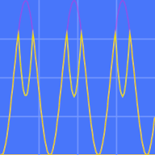

# Oscilate


## Oscilate is a Wave user-friendly class for Processing
- **easy to start and play**
  - made to be manipuled live and created easily
  - method to adapt result for your needs
  - visual oscilloscope implemented 
- **for visuals or anything else**
  - wave folder method like buchla west-coast synth
  - switch between wave forms
  
## How does it works ?

Add Oscilate.pde as a new tab in your P5 sketch or copy class where you want.

#### Basic example
```java
Oscilate osc; // class reference

void setup(){
    size(512, 256);
    osc = new Oscilate(255); // max value, min is 0
}

void draw(){
    background(osc.sine(1)); //speed from 0.0 to ...
    osc.scope(0, 0); // position of oscilloscope
}
```
The size of oscilloscope is adapt to max value


## There is another wave forms?

Yes, then can be fixed :
```java
osc.tri(2.5); // triangle
osc.saw(0.4); // saw 
osc.isaw(1.2); // inverted saw
osc.sqr(0.9); // square
osc.noisy(3.2); // random noise
```
or change on the fly : 
```java
osc.wave(0, 2.3); // change 0 to another number
```
| number | wave form       |
|--------|-----------------|
|    0   | sine            |
|    1   | triangle        |
|    2   | saw             |
|    3   | invert saw      |
|    4   | square          |
|    5   | noise           |
|    6   | keep last value |

### Helpers method

#### Adapt amplitude


```java
osc.isaw(2.5);
osc.amplitude(0.7); // from 0.0 to ... - 1 is normal
```

#### Cutoff value


```java
osc.sqr(3.2);
osc.cutoff(189); // value higher 231 now be 231
```

#### Fold wave on itself inspired from buchla synth



```java
osc.sine(3.2);
osc.fold(202); // value higher will fold under to 0
```

Use these functions in this order

```java
osc.isaw(2.5); //always wave first
osc.amplitude(2.4); 
//finish by
osc.fold(185);
//or
osc.cutoff(202); 
```

Use functions directly or put it in a variable

```java
circle(osc.saw(2.2), 120, 62);
 
result = osc.cutoff(192); 
```
